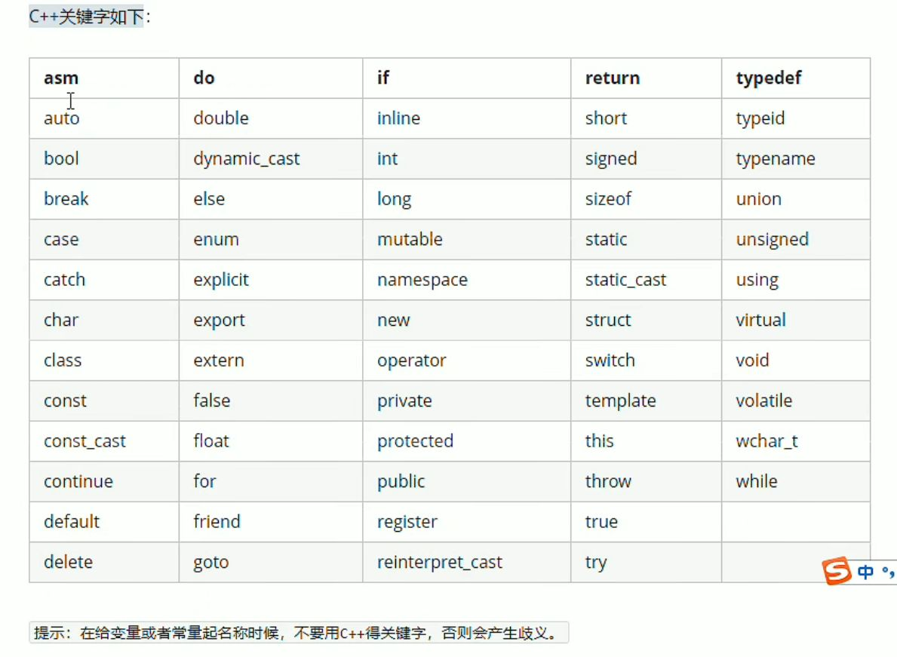
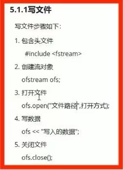
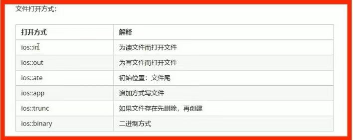
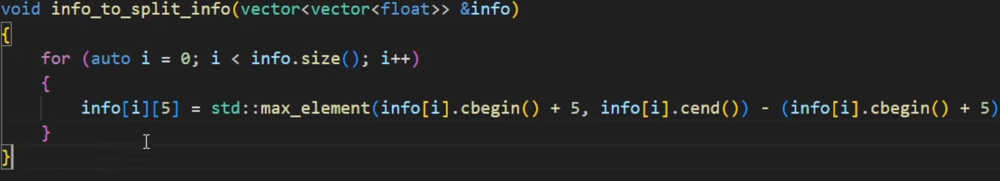
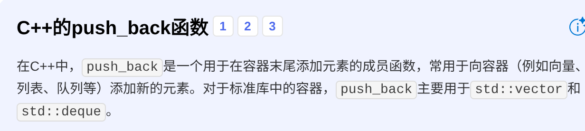
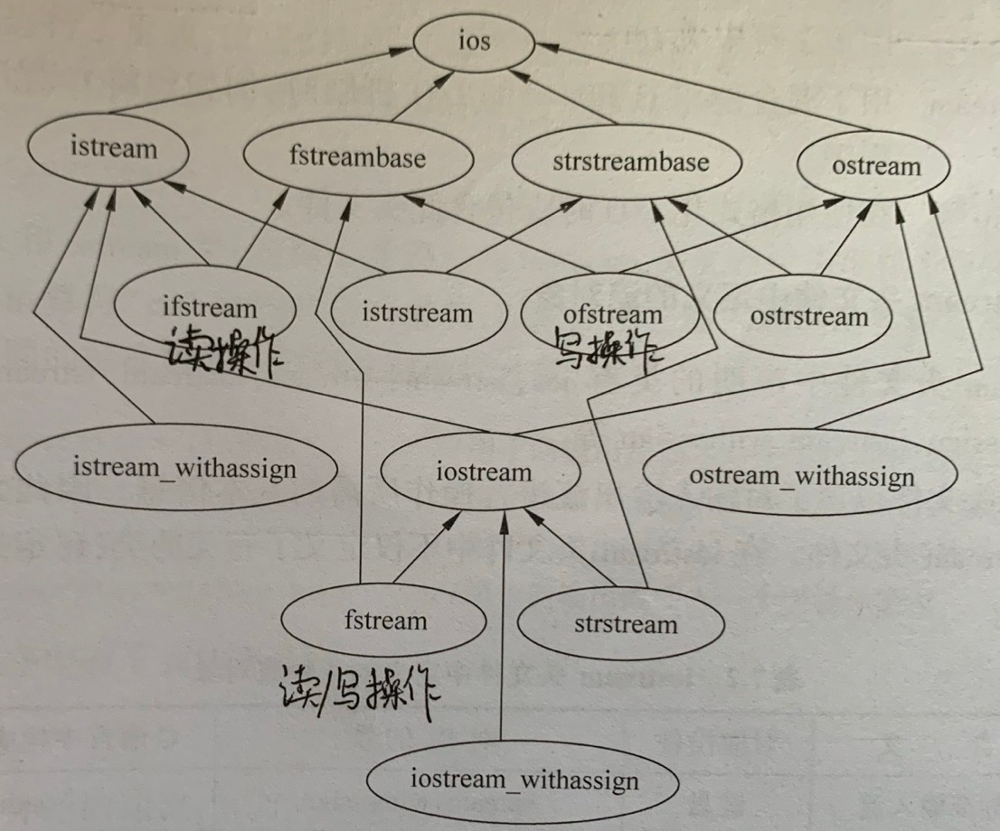
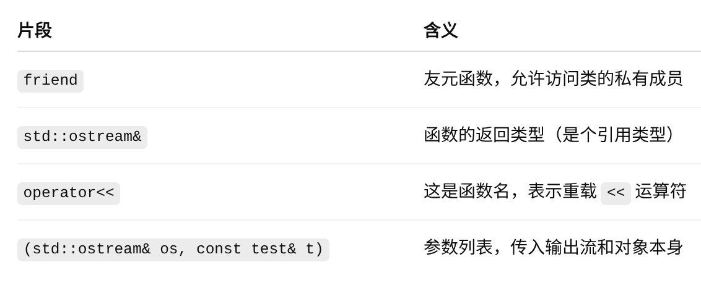

#  一、C++

- **面向程序设计：**核心概念分为一下几点，代表语言有C++、Java、Python、C#、Ruby 等
  - **封装（Encapsulation）**：把数据和操作封装在类中，对外提供接口
  - **继承（Inheritance）**：子类继承父类，实现代码复用
  - **多态（Polymorphism）**：同一方法调用，不同对象表现不同行为
  - **抽象（Abstraction）**：提取共性，隐藏细节

- **泛型编程：**C++ 的泛型编程（Generic Programming）是一种编写与具体数据类型无关的代码的编程范式，它通过 **模板（Templates）** 实现，让函数或类可以适用于多种数据类型，从而提高代码的复用性和灵活性。

  1. **函数模板：**泛型函数示例：

  ```
  #include <iostream>
  using namespace std;
  
  // 定义一个函数模板
  template <typename T>
  void swapValues(T &a, T &b) {
      T temp = a;
      a = b;
      b = temp;
  }
  
  int main() {
      int x = 10, y = 20;
      cout << "交换前: x = "<< x << ", y = "<< y << endl;
      swapValues(x, y);  // 自动推导为 int 类型
      cout << "交换后: x = "<< x << ", y = "<< y << endl;
  
      double a = 1.1, b = 2.2;
      cout << "交换前: a = "<< a << ", b = "<< b << endl;
      swapValues(a, b);  // 自动推导为 double 类型
      cout << "交换后: a = "<< a << ", b = "<< b << endl;
  
      return 0;
  }
  ```

​		2.**类模板：**示例		

```
#include <iostream>
using namespace std;

// 定义一个类模板
template <typename T>
class Box {
private:
    T content;
public:
    Box(T c) : content(c) {}

    void show() {
        cout << "Box 中的内容是: " << content << endl;
    }
};

int main() {
    Box<int> intBox(123);
    intBox.show();  // Box 中装的是 int

    Box<string> strBox("Hello, 泛型!");
    strBox.show();  // Box 中装的是 string

    return 0;
}
```

###### 框架:

```
<#include "iostream"
using namespace std;
int main()
 { 
		system("pause");
		return 0;
}
```

#### 打印格式：

`cout << "text" << end1;`

`cout << "a =" << a(代表值) << end1;`

## 1.cpp的一些关键字

##### -const:不可修改的常量

#### 1.1关键字：



#### 1.2转义字符：

##### -字符串：string x = "s"『c++风格』

##### -布尔类型：bool x = true/false

##### -数据输入：cin >> x

## 2.内存分区：

[^运行前]: 

代码区：所有代码

全局区：全局/静态变量，常量等

[^运行后]: 

栈区：编译器自动分配释放，存放函数参数值，局部变量等

堆区：程序员分配释放

！生命周期不同

##### -开辟内存：new data_type

**在 C++ 中，`cv::` 是 OpenCV 库的命名空间前缀，表示你正在使用 OpenCV 的函数、类或变量**

## 3.引用：

**引用格式：**`<data_type &别名 = 原名>`

-初始化后不可改变

-可作为返回值存在<int&>，但要返回全局变量，不然非法

-本质为指针常量

**为什么要引用？**

当函数参数按 **值传递（非引用）** 时，C++ 会隐式地调用对象的 **拷贝构造函数**，将实参的值完整复制一份到函数内部的形参中。对于复杂对象会消耗资源

##### 形参修饰实参：地址传递（指针）

## 4.函数高级：

##### 默认参数：func(int a = 0)

##### 占位参数：func(int a = 0,int)

##### 函数重载：函数名可相同，提高复用性->同作用域，不同参数

函数调用时先在主函数中声明，若参数为类名，为`<类名>&`；声明格式即类似头文件

## 5.类和对象：

### 5.1封装：<class 类名{权限：属性/行为}> 

-> **权限**：public/provided(父子间可知道)/protected(父子间不可知)

vs struct =默认访问权限不同	私有vs公有

**一个类中应至少有一个公有函数，否则在外无法对对象进行任何操作**

| **`public`**    | 类内部、派生类（子类）、类的使用者（外部代码）               |
| --------------- | ------------------------------------------------------------ |
| **`protected`** | **类内部、派生类（子类）** ，但 **外部代码（非子类）不能访问** |
| **`private`**   | **仅类内部可以访问** ，派生类和外部代码都 **不能访问**       |

### 5.2构造函数和析构函数：析构前加～

！析构大概就是释放内存和删除变量，示例：

`类名::构造函数名([参数表])[:成员初始化表]{[构造函数体]}`

```
class ClassName {
public:
    // 构造函数声明（与类名相同，无返回类型）
    ClassName(参数列表);  // 构造函数声明
};
```

方式：->括号法：1.默认构造；2.放在参数里引用；3.拷贝构造

`			->显示法：括号法的展开版                                                                                                                             

​			->隐式转换法：简化式显示法

！规则：一个类至少三个函数

->深拷贝vs浅拷贝：编译器自带的函数是浅拷贝（内存重复释放）

->类对象作为类成员先析构

->访问静态成员：1.对象访问(创建一个中间量)2.类名访问(::为中间量)

- **转换构造函数：**将一个类的对象转换成另一个类的数据

### 5.3对象模型

->成员函数和成员变量分开储存

#### this指针：

指向被调用成员函数所属对象

*this指向指针所指本体

->空指针也可访问成员，this不能（本质为指针常量）

#### 常对象和常函数：

对象前加const为常对象（不可修改成员属性，除非声明前加mutable）；函数后加const为常函数(常对象只能调用常函数)

#### 友元：

让一个函数/类访问类里的私有成员

`friend void 类名::友元函数名(&参数)`

#### 运算符/操作符重载：

`<类 operator运算符/操作符(类 &p1,类&p2)>全局函数`

也有仿函数重载

重载意为对一个已有的函数赋予新的含义，使之实现新的功能(operator是专门用于定义重载运算符的函数)

- 运算符重载作为成员函数，则它可以通过指针this自由的访问本类的数据成员，可以少写一个函数的参数。且重载符号左侧要为第一个参数，右侧为第二个

- **重载流插入/重载流提取：**  

  在类中定义的流符号只有在输出类对象时才会使用重载

#### 继承：减少重复代码

<class 子类「派生类」：继承方式 父类「基类」>

公有/私有/保护继承

**类的派生：**从已有的类中通过继承产生一个新的子类

**声明格式：**

```
class 派生类名:[继承方式] 基类名
{
	派生类新增加的成员
};
```

- 从基类接收成员
- 调整从基类接收的成员
- 在声明派生类时增加的成员

**访问属性：**举例

```
#include <iostream>
using namespace std;

// 基类
class Animal {
public:
    void eat() { cout << "Animal eats" << endl; }
protected:
    int age;
private:
    string secret = "hidden";
};

// 派生类
class Dog : public Animal { // public继承
public:
    void bark() { cout << "Dog barks" << endl; }
    void showAge() { cout << "Age: " << age << endl; } // age可访问，因为是protected
    // secret 不能访问，因为是private
};

int main() {
    Dog d;
    d.eat();   // 继承自 Animal
    d.bark();  // Dog 自己的方法
}
```

派生类无法调用私有基类的私有成员

- **保护继承**：把基类原本的公有成员也保护起来

**为什么在派生类中需要初始化基类成员？**

因为 **派生类对象中包含基类的部分**，当创建派生类对象时，**基类的构造函数也必须被调用，以正确初始化基类那部分的数据成员和状态。**

基类的构造函数无法继承，则可以在执行构造函数使执行基类的构造函数，用于变量初始化 

- **单继承和多重继承：**前者是一个类从一个基类派生而来，后者是一个派生类同时继承多个基类

- **同名覆盖**：基类同名成员在派生类中被屏蔽，对于函数来说，参数个数类型相同才会发生同名覆盖，其余情况为函数重载。所以在访问基类同名成员时需要**声明作用域**，是一种十分常见的用法

- **虚基类：**在继承间接共同基类时减少数据冗余，即继承时只保留一份成员，防止菱形继承中最初类被反复构造的问题。

  声明格式-->`class 派生类名:virtual 继承方式 基类名`

  **派生类通过构造函数调用了虚基类的构造函数会不会造成重复初始化？**

  c++编译系统只执行最后的派生类对虚基类的构造函数调用

  **什么是二义性？**

  当一个基类有多个派生类，派生类有共有一个多重继承的类，若通过多重继承类访问基类成员，会造成编译期不知道该通过那个派生类访问

- **赋值兼容：**不同类型数据之间的自动转换和赋值，但**子类型关系是单向，不可逆的**，故只能用子类对象对其基类对象进行赋值
- 指向基类对象的指针变量可以用来指向派生类对象，但不能用于指向派生类中新增加的成员

#### 派生类函数

在 **C++ 面向对象编程（OOP）** 中，**派生类函数** 指的是：

> **定义在派生类（Derived Class，也叫子类）中的成员函数，包括：**
>
> 1. **从基类继承而来的函数（成员函数）**
> 2. **派生类中重写（override）的基类虚函数**
> 3. **派生类自己新增的函数（派生类独有的功能）**

派生类和基类的关系：派生类是基类的具象化，基类是派生类的抽象

- **派生类子对象monitor,基类函数void play,则monitor.play是什么意思？**

  `monitor.play`表示：你创建了一个派生类的对象 `monitor`，然后通过这个对象调用了基类函数 `play()`，并在派生类private中初始化对象

- 派生类对象可以代替基类对象向基类对象的引用初始化或赋值

#### 多态：

**同一个接口（比如函数调用、操作符等）在不同的对象上表现出不同的行为**

- 静态多态：函数重载、运算符重载、模板等，在编译期间就确定了调用哪个函数


「地址早绑定」

- 动态多态：通过 **基类指针/引用 指向派生类对象，并调用虚函数**，实际调用哪个函数由 **运行时对象的实际类型决定**，派生类和虚函数等


「地址晚绑定」

- **虚函数：**作用为允许在派生类中重新定义与基类同名的函数，而且可以通过基类指针或引用来访问基类和派生类中的同名函数,实现动态多态;处理不同派生层级上同名函数的问题

  **在基类中，使用关键字 `virtual`声明一个成员函数：**

  ```
  class Base {
  public:
      virtual void func() {  // ✅ 这是一个虚函数
          cout << "Base::func()" << endl;
      }
  };
  ```

  **派生类中可以 重写（override） 这个虚函数：**

  ```
  class Derived : public Base {
  public:
      void func() override {  // ✅ 重写基类的虚函数（C++11 推荐使用 override）
          cout << "Derived::func()" << endl;
      }
  };
  ```

#### 纯虚函数和抽象类

- **纯虚函数**：<virtual 返回类型 函数名 （参数列表）= 0;>

- **抽象类：**抽象类的唯一目的就是用它作为基类去建立派生类，即不用来定义对象只作为一种基本类型用于继承

**有了纯虚函数的类**就是**抽象类**「无法实例化对象」

所以抽象类的子类要重写夫类纯虚函数，不然也是抽象类

#### 虚析构和纯虚析构

**虚析构**：<`virtual ~类名(){}`>

**纯虚析构**：<`virtual ~类名() = 0；类名 :: ~类名(){}`>

**如果你用 `new`创建了一个对象，但没有用 `delete`手动释放它，那么 析构函数不会被调用，会导致内存泄漏！**

```
#include <iostream>
using namespace std;

class MyClass {
public:
    MyClass() {
        cout << "构造函数被调用" << endl;
    }

    ~MyClass() {
        cout << "析构函数被调用" << endl;
    }
};

int main() {
    MyClass* p = new MyClass();  // 动态分配对象
    // 必须手动 delete，否则不会调用析构函数，可能导致内存泄漏！
    delete p;  // 手动释放对象，此时析构函数被调用
    return 0;
}
```

！子类有堆区数据时，解决父类指针释放子类对象不干净的问题

程序用带有参数指针的delete撤销对象时，系统会执行基类的析构函数而不会执行派生类的

#### 关联

确定调用的具体对象的过程(bind)

- **静态关联：**通过函数重载和调用对象名的虚函数，在编译时确定虚函数的类
- **动态关联：**运行阶段吧虚函数和类对象绑定在一起

**类内访问？**

在类的内部（定义类的代码内部），无论成员被声明为 public、protected 还是 private，都是可以互相访问的，**没有访问权限的限制**。 在类的外部（定义类的代码之外），只能通过对象访问成员，并且通过对象只能访问 public 属性的成员，不能访问 private、protected 属性的成员。

**用struct和class命名的类有什么区别？**

struct命名的不加权限默认为public,class则反之

- 数据共享：在对于静态变量而言，他的值对于所以对象都是固定的
- 对于类对象，不能直接进行赋值运算、数值运算、关系运算、逻辑运算和输出输入操作

## 6.文件操作

### 操作

**头文件包含**：#include <fstream>

1.<ofstream>:写操作

2.<ifsream>:读操作

3.<fsream>:读写操作





读取文件方法：

1.直接读取；2.行读取；3.逐字读取.

二进制方式写/读：

<ifs.write/read> 配合使用，不然会乱码

!!包含不同的头文件会引入不同的命名空间，而不同空间内同名文件内容是不同的，所以快速修复谨慎使用，防止将用户空间的头文件与内核空间的混淆

!主函数中包含类声明头文件用双引号，不用尖括号7.容器

## 7.容器

### 7.1顺序性容器

|     容器     |                           简介说明                           |
| :----------: | :----------------------------------------------------------: |
|    vector    | 可变大小数组。相当于数组，可动态构建，支持随机访问，无头插和尾插，仅支持inset插入，除尾部外的元素删除比较麻烦。但使用最为广泛 |
|    deque     | 双端队列。支持头插、删，尾插、删，随机访问较vector容器来说慢,但对于首尾的数据操作比较方便 |
|     list     | 双向循环链表。使用起来很高效，对于任意位置的插入和删除都很快，在操作过后，以后指针、迭代器、引用都不会失效 |
| forward_list | 单向链表。只支持单向访问，在链表的任何位置进行插入/删除操作都非常快 |
|    array     | 固定数组。vector的底层即为array数组，它保存了一个以严格顺序排列的特定数量的元素 |

`vector<vector<float>>` 是 C++ 中的一种数据结构，表示 **二维浮点数向量**（即“向量的向量”），可以理解为一个“动态的二维数组”，其中：

- **外层 `vector`** 存储多个内层 `vector`（即多行数据）。
- **内层 `vector`** 存储一组 `float` 类型的浮点数（即一行中的多个列数据）。
- 

定义了一个名为 `info_to_split_info` 的函数，它的作用是遍历一个二维 `std::vector`（即 `vector<vector<float>>` 类型的对象 `info`），对于其中的每一个一维子 `vector`，找到从索引 `5` 开始到末尾的所有元素中的最大值，并将该最大值赋值给子 `vector` 的第 `6` 个元素（索引为 `5` ，因为C++ 中容器索引从 `0` 开始）。



### 7.2关联式容器

|                             容器                             |                           简介说明                           |
| :----------------------------------------------------------: | :----------------------------------------------------------: |
|                         set/mutliset                         | 集合/多重集合。对于set，在使用insert插入元素时，已插入过的元素不可重复插入，这正好符合了集合的互异性，在插入完成显示后，会默认按照升序进行排序，对于[multiset](https://zhida.zhihu.com/search?content_id=213478473&content_type=Article&match_order=1&q=multiset&zhida_source=entity)，可插入多个重复的元素 |
| map/[mutlimap](https://zhida.zhihu.com/search?content_id=213478473&content_type=Article&match_order=1&q=mutlimap&zhida_source=entity) | 映射/多重映射。二者均为二元关联容器（在构造时需要写两个参数类型，前者对key值，后者对应value值），因为有两个参数，因此在插入元素的时候需要配合对组pair进行插入，具体见深入详解 |

## 8.输入输出

- **流：**缓冲区中的数据

|    类名    |                 作用                 | 在哪个头文件中声明 |                           示例用法                           |
| :--------: | :----------------------------------: | :----------------: | :----------------------------------------------------------: |
|    ios     |               抽象基类               |      iostream      | `std::ios::sync_with_stdio(false);`// 取消与 C 标准 IO 的同步 |
|  istream   |     通用输入流和其他输入流的基类     |      iostream      |       `int num; std::cin >> num;`// 从标准输入读取整数       |
|  ostream   |     通用输出流和其他输出流的基类     |      iostream      | `std::cout << "Hello, World!" << std::endl;`// 输出到标准输出 |
|  iostream  | 通用输入输出流和其他输入输出流的基类 |      iostream      | `std::iostream iostr(cin.rdbuf()); iostr << "Input: ";`// 组合输入输出操作 |
|  ifstream  |             输入文件流类             |      fstream       | `std::ifstream inFile("example.txt"); std::string line; while (getline(inFile, line)) { /* 处理每行 */ }` |
|  ofstream  |             输出文件流类             |      fstream       | `std::ofstream outFile("output.txt"); outFile << "This is a test.";` |
|  fstream   |           输入输出文件流类           |      fstream       |        `std::fstream ioFile("data.txt", std::ios::in         |
| istrstream |            输入字符串流类            |     strstream      | `char buffer[] = "123 456"; std::istrstream istr(buffer); int a, b; istr >> a >> b;` |
| ostrstream |            输出字符串流类            |     strstream      | `std::ostrstream ostr(nullptr, 100); ostr << "The answer is " << 42; char* str = ostr.str();` |
| strstream  |          输入输出字符串流类          |     strstream      | `char buffer[] = "Hello"; std::strstream strstr(buffer, sizeof(buffer), std::ios::in |



- **输出输入控制流：**

   1. **常用格式控制符（来自 `<iomanip>`和 `<iostream>`）**

  |      控制符       |          头文件           |                           功能说明                           |                          示例                          |
  | :---------------: | :-----------------------: | :----------------------------------------------------------: | :----------------------------------------------------: |
  |      `endl`       |       `<iostream>`        |                     输出换行并刷新缓冲区                     |               `cout << "Hello" << endl;`               |
  |     `setw(n)`     |        `<iomanip>`        |       设置下一个输出项的**宽度为 n 个字符**（对齐用）        |    `cout << setw(10) << 123;`（输出占10位，右对齐）    |
  | `setprecision(n)` |        `<iomanip>`        | 设置 **浮点数精度为 n（总有效数字 或 小数点后位数，取决于 fixed）** | `cout << setprecision(2) << 3.14159;`→ `3.1`或 `3.14`  |
  |      `fixed`      |        `<iomanip>`        |     指定浮点数使用 **固定小数格式（小数点后指定位数）**      | `cout << fixed << setprecision(2) << 3.14159;`→ `3.14` |
  |   `scientific`    |        `<iomanip>`        |              指定浮点数使用 **科学计数法格式**               |  `cout << scientific << 123.456;`→ 如 `1.234560e+02`   |
  |      `left`       |        `<iomanip>`        |              设置输出左对齐（配合 `setw`使用）               |          `cout << left << setw(10) << "Hi";`           |
  |      `right`      |        `<iomanip>`        |                    设置输出右对齐（默认）                    |          `cout << right << setw(10) << 123;`           |
  |   `setfill(ch)`   |        `<iomanip>`        |             设置填充字符（常与 `setw`配合使用）              |    `cout << setfill('*') << setw(5) << 7;`→ `***7`     |
  |     `showpos`     |        `<iomanip>`        |              强制显示 **正号（+）**，如 `+123`               |           `cout << showpos << 100;`→ `+100`            |
  |    `noshowpos`    |        `<iomanip>`        |                     取消显示正号（默认）                     |           `cout << noshowpos << 100;`→ `100`           |
  |    `showbase`     |        `<iomanip>`        |      显示进制前缀，比如 `0x`（十六进制）、`0`（八进制）      |       `cout << showbase << hex << 255;`→ `0xff`        |
  |   `noshowbase`    |        `<iomanip>`        |                    不显示进制前缀（默认）                    |                                                        |
  |    `uppercase`    |        `<iomanip>`        |               十六进制中的字母大写，如 `0xFF`                |       `cout << uppercase << hex << 255;`→ `0xFF`       |
  |   `nouppercase`   |        `<iomanip>`        |             十六进制字母小写（默认），如 `0xff`              |                                                        |
  |       `dec`       | `<iostream>`/ `<iomanip>` |                设置输出为 **十进制**（整数）                 |              `cout << dec << 255;`→ `255`              |
  |       `hex`       | `<iostream>`/ `<iomanip>` |               设置输出为 **十六进制**（整数）                |              `cout << hex << 255;`→ `ff`               |
  |       `oct`       | `<iostream>`/ `<iomanip>` |                设置输出为 **八进制**（整数）                 |              `cout << oct << 255;`→ `377`              |

  ------

   2. **换行与刷新**

  | 控制符  |                     说明                      |               示例               |
  | :-----: | :-------------------------------------------: | :------------------------------: |
  | `endl`  | 输出换行 **并刷新输出缓冲区**（可能影响性能） |    `cout << "Hello" << endl;`    |
  | `'\n'`  |    只是换行符，**不刷新缓冲区**，性能更好     |       `cout << "Hello\n";`       |
  | `flush` |             只刷新缓冲区，不换行              | `cout << "Loading..." << flush;` |

## 扫盲

**什么是`std::shared_ptr`？**

**`std::shared_ptr`是 C++ 标准库 `<memory>`中提供的一种**智能指针（smart pointer）**，用于**自动管理动态分配的对象的生命周期**，它通过**引用计数（reference counting）**来跟踪有多少个 `shared_ptr`指向同一个对象，当最后一个 `shared_ptr`被销毁时，它所管理的对象会被自动释放（delete）。**

**什么是命名空间？**

一个由程序设计者命名的内存区域。程序设计者可以根据需要指定一些有名字的空间域，把一些全局实体分别放在各个命名空间中，从而与其他全局实体分隔开来，避免产生名字冲突                                                                            

- 声明示例：

```
namespace 命名空间名 {
    // 可以放函数、类、变量等
    void func() {
        cout << "这是命名空间中的函数" << endl;
    }

    class MyClass {
    public:
        void show() {
            cout << "这是命名空间中的类" << endl;
        }
    };
}
```

- 调用方法：

1. ```
   #完全限定名（推荐用于明确来源）
   命名空间名::函数名();
   命名空间名::类名 对象;
   ```

2. ```
   #使用 using声明（引入某个特定符号）
   using 命名空间名::某个符号;
   ```

3. ```
   #使用 using namespace 命名空间名;（引入整个命名空间，慎用！）​
   using namespace 命名空间名;
   ```

**volatile具体概念**

**`volatile`是 C / C++ 中的关键字，用于修饰变量，告诉编译器该变量可能会被程序以外的因素（如硬件、中断、多线程、信号处理等）意外修改，因此每次访问都必须从内存中读取，不能随意优化掉读写操作。**

# 二、Vscode

### 跨平台的高级编辑器，不能直接编译

## 1.MinGW64

下载安装后配置环境变量值

在PATH路经中添加/usr/bin，确保之后g++工具的使用

*查找路经：<which 文件名>

## 2.c/c++插件

在vs应用商店下载安装后重启

！记得下载其下所有拓展插件

## 3.设置编译

ctrl+shift+p到c/c++ UI界面配置，确保路经为刚刚的编译环境路经

## 4.生成task.json文件

它自己生成了，我也不知道为啥

常理说要快捷键`ui`搜索C/C++：g++

如果是gcc，就把task.json的gcc改成g++重新生成

！文件后辍是cpp不是c++

## 5.编译

ctrl+` -> 输入./文件名

## 6.调试

查找下运行C++（GDB...），生成launch.json

->改midebugger路径为环境下载路径，下有名为gdp的文件

-> 改"program": "${fileDirname}/${fileBasenameNoExtension}（生成文件）",

->改"preLaunchTask": "C/C++: g++ 生成活动文件"

等等，言简就是把.json后辍的gcc全改成g++

F9-打/取消断点

F5-启动调试

F10-逐语句调试

F11-逐过程调试

###### ！！实用工具里没东西因为EIDE官方工具只提供给了windows,linux因为有依赖关系就只能手动下

##### 单片机环境配置：

https://blog.csdn.net/weixin_43176196/article/details/147340425?sharetype=blogdetail&sharerId=147340425&sharerefer=PC&sharesource=weixin_43176196&spm=1011.2480.3001.8118

##### 单片机项目配置：

https://blog.csdn.net/weixin_43176196/article/details/147340842

###### 头文件包含一直报错？

#### 最后发现linux里不能配keil环境:)

# 三、作业

#### tip：gcc编译链

**g++编译链->程序从原文件到二进制**


1、由.c文件到.i文件，这个过程叫**预处理**。
2、由.i文件到.s文件，这个过程叫**编译**。
3、由.s文件到.o文件，这个过程叫**汇编**。
4、由.o文件到可执行文件，这个过程叫**链接**。

#### 思路：

通过类的private权限封装他的数据包类型，用友元读取，若没有读取到帧头帧尾则重新读取，在主函数内执行发送/读取

单片机端由于上位机是字符串发送，故在每一次用char类型接收后储存进一个数组，类似于缓冲区，最后再用char类型显示，浮点型也会显示因为它的‘.’是以元素形式存在的

#### learnt：

###### 什么是流？

在C++中，**流（stream）**是一个用于处理数据输入和输出的抽象概念。流的本质是一种对象，它充当数据和程序之间的中转设备，使得我们可以通过操作流来间接操作数据

###### 下列代码什么意思？

```
    friend std::ostream& operator<<(std::ostream& os, const test& t) {

    os << "Test data: ";

   for (int i = 0; i < 10; ++i) {

    os << t.data[i] << " ";

     }

      return os;

     }
```



重载<<后：std::cout << t;  // 能直接输出 test 类对象的数据

###### ！在类成员里不能初始化不定长数组

###### !上位机发送二进制，开发板回发十六进制

###### linux系统中没有pause

###### ! 接收函数只有在接收到/n后才停止

C 库函数 int sscanf(const char *str, const char *format, ...) 从字符串读取格式化输入。

volatile 影响编译器编译的结果,volatile指出 变量是随时可能发生变化的

sprintf 是 C 标准库中的一个函数，用于将格式化的字符串写入一个字符数组中